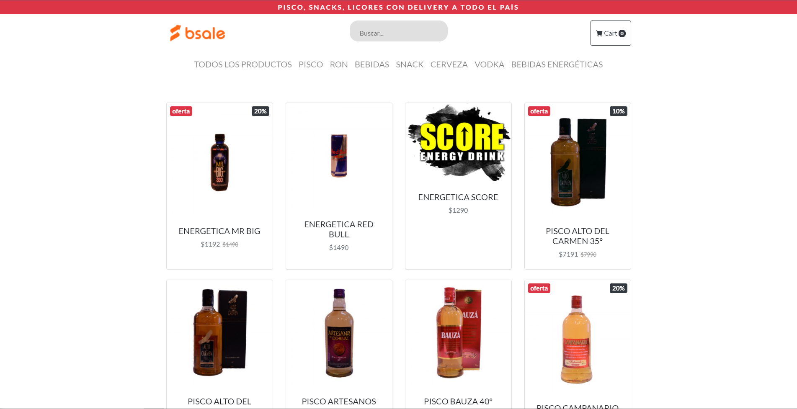

<div id="top"></div>
<!--
*** Thanks for checking out the Best-README-Template. If you have a suggestion
*** that would make this better, please fork the repo and create a pull request
*** or simply open an issue with the tag "enhancement".
*** Don't forget to give the project a star!
*** Thanks again! Now go create something AMAZING! :D
-->


<!-- PROJECT SHIELDS -->
<!--
*** I'm using markdown "reference style" links for readability.
*** Reference links are enclosed in brackets [ ] instead of parentheses ( ).
*** See the bottom of this document for the declaration of the reference variables
*** for contributors-url, forks-url, etc. This is an optional, concise syntax you may use.
*** https://www.markdownguide.org/basic-syntax/#reference-style-links
-->


<!-- PROJECT LOGO -->
<br />
<div align="center">
  <a href="https://github.com/AndresEGV/bsale-desafio-backend">
    
  </a>

  <h3 align="center">Desafio Bsale Backend </h3>

  <p align="center">
Desafío b-sale. Tienda online que despliegue productos agrupados por la categoria a la que pertenecen, generando por separado backend (API REST) y frontend (Aplicación que la consuma)
    <br />
    <a href="https://clever-hawking-a01951.netlify.app/"><strong>Ver Deploy</strong></a>
    <br />
    <br />  
  </p>
</div>

<!-- ABOUT THE PROJECT -->
## Sobre el proyecto

Ejercicio Construir una tienda online que despliegue productos agrupados por la categoría a la que pertenecen, generando por separado backend (API REST) y frontend (aplicación que la consuma).

Además, hay que agregar un buscador, el cual tiene que estar implementado a nivel de servidor, mediante una Api Rest cuyo lenguaje y framework puede ser de libre elección. Es decir, los datos de productos deben llegar filtrados al cliente.

<p align="right">(<a href="#top">back to top</a>)</p>


### BackEnd Construido con

* [Express](https://www.npmjs.com/package/express)
* [dotenv](https://www.npmjs.com/package/dotenv)
* [cors](https://www.npmjs.com/package/cors)
* [sequelize](https://www.npmjs.com/package/sequelize)
* [mysql2](https://www.npmjs.com/package/mysql2)


<p align="right">(<a href="#top">back to top</a>)</p>


<!-- GETTING STARTED -->
## Empezando
Siga las intrucciones que vienen a continuación para poder probar el proyecto localmente.


### Instalación

Instale las dependencias e inicie el servidor.
git clone https://github.com/JFelixZuniga/BSale-test-Backend.git
cd BSale-test-Backend
npm i
node index


1. Clonar el repositorio
   ```sh
   git clone https://github.com/AndresEGV/bsale-desafio-backend/
   ```
2. Instalar dependecias NPM
   ```sh
   npm install
   ```
3. Abrir terminal en el proyecto y ejecutar el siguiente comando 
   ```js
   node index.js
   ```

<p align="right">(<a href="#top">back to top</a>)</p>


## Endpoints

Esta es una API de  consumo. Solo se utilizó el  método HTTP GET.
1. [api/products](https://bsale-test-store.herokuapp.com/api/products) Retorna la cantidad total de productos en un arreglo de objetos
 ```json
  [
    {
        id: 5,
        name: "ENERGETICA MR BIG",
        url_image: "https://dojiw2m9tvv09.cloudfront.net/11132/product/misterbig3308256.jpg",
        price: 1490,
        discount: 20,
        Category: {
        id: 1,
        name: "bebida energetica"
        }
        },
        {
        id: 6,
        name: "ENERGETICA RED BULL",
        url_image: "https://dojiw2m9tvv09.cloudfront.net/11132/product/redbull8381.jpg",
        price: 1490,
        discount: 0,
        Category: {
        id: 1,
        name: "bebida energetica"
   }
 },

]
   ```
2. [/api/Products/:products](https://bsale-test-store.herokuapp.com/api/products/cerveza)  Retorna la cantidad total de productos y todos los productos que coincidan con el parámetro ingresado.
```json
 [
    {
        id: 98,
        name: "Cerveza Escudo Normal LATA 350CC",
        url_image: "",
        price: 600,
        discount: 0,
        Category: {
        id: 6,
        name: "cerveza"
        }
        },
        {
        id: 99,
        name: "Cerveza Escudo Sin Filtrar LATA 350CC",
        url_image: "",
        price: 800,
        discount: 0,
        Category: {
        id: 6,
        name: "cerveza"
    }
  }
]
   ```
3. [/api/categories/snack](https://bsale-test-store.herokuapp.com/api/categories/snack) Recibe como parámetro el string de una categoría y retorna todos los productos pertenecientes a la categoría ingresada.
```json
[
  {
    name: "snack",
    Products: [
      {
          name: "Maní salado",
          url_image: "https://dojiw2m9tvv09.cloudfront.net/11132/product/manisaladomp4415.jpg",
          price: 600,
          discount: 0
          },
          {
          name: "Mani Sin Sal",
          url_image: "https://dojiw2m9tvv09.cloudfront.net/11132/product/manisinsalmp6988.jpg",
          price: 500,
          discount: 0
          },
          {
          name: "Papas Fritas Lisas Bolsa Grande",
          url_image: "https://dojiw2m9tvv09.cloudfront.net/11132/product/papaslisasgrande7128.jpg",
          price: 1490,
          discount: 0
          },
          {
          name: "Papas Fritas Bolsa Pequeña",
          url_image: "https://dojiw2m9tvv09.cloudfront.net/11132/product/papaslisas7271.jpg",
          price: 500,
          discount: 0
          },
          {
          name: "Papas Fritas Tarro",
          url_image: "https://dojiw2m9tvv09.cloudfront.net/11132/product/78028005335657432.jpg",
          price: 1990,
          discount: 0
      }
    ]
  }
]
   ```
<p align="right">(<a href="#top">back to top</a>)</p>


